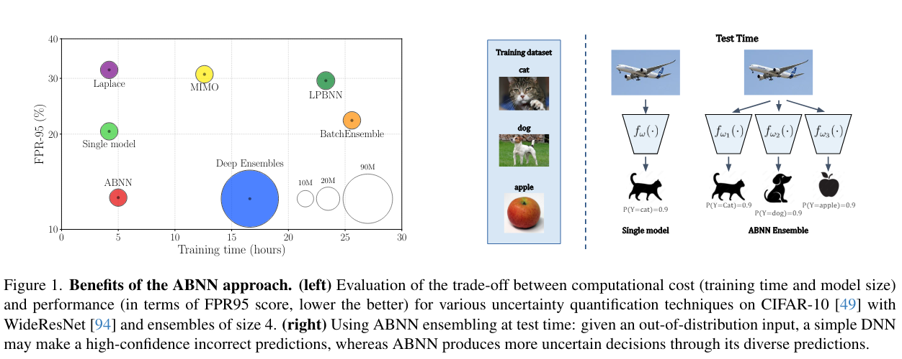

# Make Me a BNN: A Simple Strategy for Estimating Bayesian Uncertainty from Pre-trained Models

This readme file is an outcome of the [CENG502 (Spring 2024)](https://ceng.metu.edu.tr/~skalkan/ADL/) project for reproducing a paper without an implementation. See [CENG502 (Spring 2024) Project List](https://github.com/CENG502-Projects/CENG502-Spring2024) for a complete list of all paper reproduction projects. The public repository and commit history is available in the account here: https://github.com/AbtinMogharabin/MakeMe-BNN.

# 1. Introduction

The challenge of effectively quantifying uncertainty in predictions made by deep learning models, particularly Deep Neural Networks (DNNs), is crucial for their safe deployment in risk-sensitive environments. DNNs are typically deterministic, providing point estimates without any measure of confidence, which can lead to overconfident decisions in many real-world applications, particularly in safety-critical domains such as autonomous driving, medical diagnoses, industrial visual inspection, etc. 

Traditional Bayesian Neural Networks (BNNs) represent a probabilistic approach to neural networks where the weights are treated as random variables with specified prior distributions, rather than fixed values. This method allows BNNs to not only make predictions but also to estimate the uncertainty of these predictions by integrating over the possible configurations of weights. To compute these integrations, which are generally intractable due to the high dimensionality of the parameter space, BNNs typically employ approximation techniques like Variational Inference (VI) or Markov Chain Monte Carlo (MCMC). These methods, however, introduce significant computational overhead and complexity. VI, for instance, requires the selection of a tractable family of distributions that can limit the expressiveness of the model, while MCMC is computationally expensive and slow to converge, particularly for large datasets or complex network architectures.

Given these challenges, the deployment of traditional BNNs in real-world applications, especially those requiring real-time operations or running on limited hardware, becomes impractical. The paper "Make Me a BNN: A Simple Strategy for Estimating Bayesian Uncertainty from Pre-trained Models" introduces an innovative approach, termed Adaptable Bayesian Neural Network (ABNN), which allows the conversion of existing pre-trained DNNs into BNNs. This conversion is achieved in a post-hoc manner—after the DNN has been trained—requiring minimal computational resources and avoiding extensive retraining. This paper was published at CVPR (Conference on Computer Vision and Pattern Recognition) in 2024.

ABNN preserves the main predictive properties of DNNs while enhancing their uncertainty quantification abilities. The paper conducts extensive experiments across multiple datasets for image classification and semantic segmentation tasks, and demonstrates that ABNN achieves state-of-the-art performance without the computational budget typically associated with ensemble methods. The following figure shows a brief comparison of ABNN and a number of other uncertainty-based deep learning approaches in literature:

    

In this repository, we make an effort to reproduce the methods and results of the paper based on the descriptions provided.

## 1.1. Paper summary

The ABNN approach starts with a pre-trained DNN and transforms it into a Bayesian Neural Network (BNN) by introducing Bayesian Normalization Layers (BNLs) to the existing normalization layers (like batch or layer normalization). This transformation involves adding Gaussian noise to the normalization process, thereby incorporating uncertainty into the model's predictions without extensive retraining. The process is designed to be computationally efficient, requiring only minimal additional training (fine-tuning) to adjust the new layers, making it feasible to implement on existing models without significant computational overhead.

    

The key contributions of this paper are as follows:

- ABNN provides a scalable way to estimate uncertainty by leveraging pre-trained models and transforming them with minimal computational cost. This approach circumvents the traditionally high resource demands of training BNNs from scratch or employing ensemble methods.
- The method is compatible with multiple neural network architectures such ResNet-50, WideResnet28-10; and ViTs. The only requirement for ABNN to have compatiblity with a DNN architectures is that the DNN should include normalization layers.
- ABNN can estimate the posterior distribution around the local minimum of the pre-trained model in a resource efficient manner while still achieving competitive uncertainty estimates with diversity. The results indicate that ABNN achieves comparable or superior performance in uncertainty estimation and predictive accuracy compared to existing state-of-the-art methods like Deep Ensembles and other Bayesian methods in both in- and out-of-distribution settings
- Stability and Performance: It is noted that ABNN offers more stable training dynamics compared to traditional BNNs, which are often plagued by training instabilities. The use of Bayesian Normalization Layers helps mitigate these issues, providing a smoother training process and robustness in performance.
- ABNN allows for sequential training of multiple BNNs starting from the same checkpoint, thus modeling various modes within the true posterior distribution.
- It is also observed that the variance of the gradient for ABNN’s parameters is lower compared to that of a classic BNN, resulting in a more stable backpropagation.

# 2. The method and my interpretation

## 2.1. The original method

@TODO: Explain the original method.

## 2.2. Our interpretation 

@TODO: Explain the parts that were not clearly explained in the original paper and how you interpreted them.

# 3. Experiments and results

## 3.1. Experimental setup

@TODO: Describe the setup of the original paper and whether you changed any settings.

There are mulitple datasets: 

1- CIFAR-10 and CIFAR-100 for ResNet-50 and WideResNet28-10.  https://www.cs.toronto.edu/~kriz/cifar.html

2- ImageNet whichthey reported the results for ABNN on it with ResNet-50 and ViT. https://www.image-net.org/download.php

They used the datesets and transform the initial problem into binary classification between in-distribution
and out-of-distribution data using the maximum softmax probability as the criterion.

3- SVHN dataset as the out-of-distribution dataset for OOD detection tasks on CIFAR-10 and CIFAR-100. http://ufldl.stanford.edu/housenumbers/

4- Describable Texture as the out-of-distribution dataset on ImageNet. https://www.robots.ox.ac.uk/~vgg/data/dtd/

## 3.2. Running the code

@TODO: Explain your code & directory structure and how other people can run it.

## 3.3. Results

@TODO: Present your results and compare them to the original paper. Please number your figures & tables as if this is a paper.

# 4. Conclusion

@TODO: Discuss the paper in relation to the results in the paper and your results.

# 5. References

@TODO: Provide your references here.

# Contact

@TODO: Provide your names & email addresses and any other info with which people can contact you.

