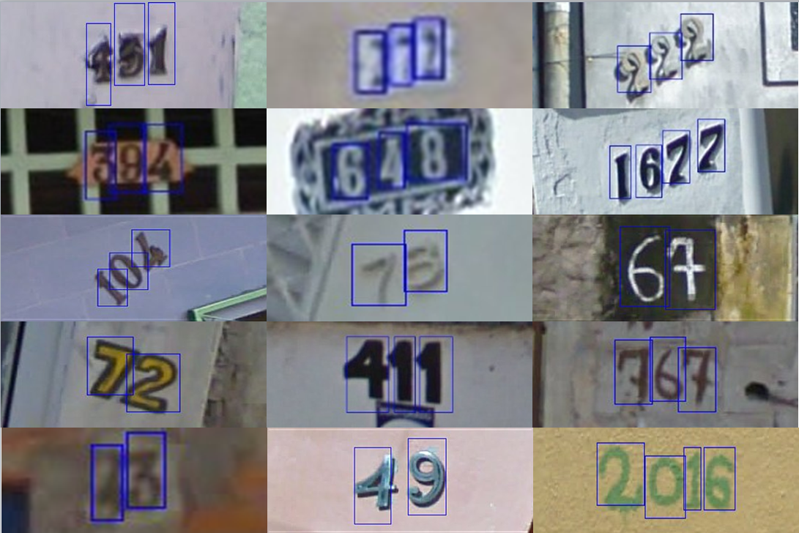

# Make Me a BNN: A Simple Strategy for Estimating Bayesian Uncertainty from Pre-trained Models

This readme file is an outcome of the [CENG502 (Spring 2024)](https://ceng.metu.edu.tr/~skalkan/ADL/) project for reproducing a paper without an implementation. See [CENG502 (Spring 2024) Project List](https://github.com/CENG502-Projects/CENG502-Spring2024) for a complete list of all paper reproduction projects. The public repository and commit history are available [here](https://github.com/AbtinMogharabin/MakeMe-BNN).


# 1. Introduction

The challenge of effectively quantifying uncertainty in predictions made by deep learning models, particularly Deep Neural Networks (DNNs), is crucial for their safe deployment in risk-sensitive environments. DNNs are typically deterministic, providing point estimates without any measure of confidence. This can lead to overconfident decisions in many real-world applications, particularly in safety-critical domains such as autonomous driving, medical diagnoses, industrial visual inspection, etc. 

Traditional Bayesian Neural Networks (BNNs) represent a probabilistic approach to neural networks where the weights are treated as random variables with specified prior distributions rather than fixed values. This method allows BNNs to not only make predictions but also to estimate the uncertainty of these predictions by integrating over the possible configurations of weights. To compute these integrations, which are generally intractable due to the high dimensionality of the parameter space, BNNs typically employ approximation techniques like Variational Inference (VI) or Markov Chain Monte Carlo (MCMC). These methods, however, introduce significant computational overhead and complexity. VI, for instance, requires the selection of a tractable family of distributions that can limit the expressiveness of the model. At the same time, MCMC is computationally expensive and slow to converge, particularly for large datasets or complex network architectures.

Given these challenges, the deployment of traditional BNNs in real-world applications, especially those requiring real-time operations or running on limited hardware, needs to be more practical. The paper "Make Me a BNN: A Simple Strategy for Estimating Bayesian Uncertainty from Pre "trained Models" introduces an innovative approach, termed Adaptable Bayesian Neural Network (ABNN), which allows the conversion of existing pre-trained DNNs into BNNs. This conversion is achieved in a post-hoc manner—after the DNN has been trained—requiring minimal computational resources and avoiding extensive retraining. This paper was published at CVPR (Conference on Computer Vision and Pattern Recognition) in 2024.

ABNN preserves the main predictive properties of DNNs while enhancing their uncertainty quantification abilities. The paper conducts extensive experiments across multiple datasets for image classification and semantic segmentation tasks. It demonstrates that ABNN achieves state-of-the-art performance without the computational budget typically associated with ensemble methods. The following figure shows a brief comparison of ABNN and a number of other uncertainty-based deep learning approaches in literature:

<div align="center">
    
    <p id= "Procedure">Figure 1: Figure from Franchi et al. (2024)</p>  
</div>

In this repository, we make an effort to reproduce the methods and results of the paper based on the descriptions provided.

## 1.1. Paper summary

The ABNN approach starts with a pre-trained DNN and transforms it into a Bayesian Neural Network (BNN) by introducing Bayesian Normalization Layers (BNLs) into existing normalization layers such as batch or layer normalization. This transformation involves adding Gaussian noise to the normalization process, thereby incorporating uncertainty in the model's predictions without extensive retraining. The process is designed to be computationally efficient, requiring only minimal additional training (fine-tuning) to adjust the new layers, making it feasible to implement on existing models without significant computational overhead.

<div align="center">
    
    <p id= "Procedure">Figure 2: Figure from Franchi et al. (2024)</p>  
</div>

The key contributions of this paper are as follows:

- ABNN provides a scalable way to estimate uncertainty by leveraging pre-trained models and transforming them with minimal computational cost. This approach circumvents the traditionally high resource demands of training BNNs from scratch or employing ensemble methods.
- The method is compatible with multiple neural network architectures such as ResNet-50, WideResnet28-10, and ViTs. The only requirement for ABNN to be compatible with a DNN architecture is that the DNN should include normalization layers (such as batch, layer, or instance normalization). This is not a limiting factor as most modern architectures include one type of these layers
- ABNN can estimate the posterior distribution around the local minimum of the pre-trained model in a resource-efficient manner while still achieving competitive uncertainty estimates with diversity. The results indicate that ABNN achieves comparable or superior performance in uncertainty estimation and predictive accuracy compared to existing state-of-the-art methods like Deep Ensembles and other Bayesian methods in both in- and out-of-distribution settings
- Stability and Performance: It is noted that ABNN offers more stable training dynamics compared to traditional BNNs, which are often plagued by training instabilities. The use of Bayesian Normalization Layers helps mitigate these issues, providing a smoother training process and robustness in performance.
- ABNN allows for sequential training of multiple BNNs starting from the same checkpoint, thus modeling various modes within the actual posterior distribution.
- It is also observed that the variance of other transient ABNN parameters is lower compared to that of a classic BNN, resulting in a more stable backpropagation.
- Based on my review, this paper demonstrates one of the very few efforts to translate a deterministic model into a Bayesian version after the training of the deterministic model is finished. To name the two most relevant approaches:
  1. **Deterministic Variational Inference Approach:**
     - One paper by Wu et al. (2019) employs deterministic variational inference techniques to integrate Bayesian methods into trained deterministic neural networks. It introduces closed-form variance priors for the network weights, allowing the deterministic model to handle uncertainty estimations through a robust Bayesian framework after its initial training [2].
     - Compared to this approach, which requires extensive modifications to the network's inference process to accommodate the new Bayesian priors, the "Make Me a BNN" paper introduces a method that is notably simpler and potentially faster, as it leverages existing normalization layers within pre-trained DNNs to implement Bayesian functionality.

  2. **Decoupled Bayesian Stage Approach:**
     - Another study by Maronas et al. (2020) involves a decoupled Bayesian stage applied to a pre-trained deterministic neural network. This method uses a Bayesian Neural Network to recalibrate the outputs of the deterministic model, thereby improving its predictive uncertainty without retraining the entire network from scratch [3].
     - "Make Me a BNN" paper introduces a quick deployment and straightforward integration into existing models by attaching simple adaptable Bayesian modules directly to the normalization layers. But effective calibration improvement involves adding an entirely new Bayesian processing layer, might not be the most efficient way to introduce Bayesian uncertainty into existing models.


# 2. The method and my interpretation

## 2.1. The original method

### 2.1.1  Model General Overview

The paper conducts a multi-step theoretical analysis of the model's key elements. They explained their reasoning behind each of the chosen methods.

1. In the supplementary material, they show that ABNN exhibits more excellent stability than classical BNNs. This is because, in variational inference BNNs, the gradients crucial for obtaining the Bayesian interpretation vary greatly. This often introduces instability, perturbating the training. ABNN reduces this burden by applying this term to the latent space rather than the weights.

2. In the literature, because of the non-convex nature of the DNN loss, there might exist a need to modify the loss. By adding a new $\varepsilon$ term, they show  empirical benefits for performance and uncertainty quantification

3. Although using BNNs theoretically provides valuable information, they remain unused in practice because of challenges in computing full posteriors. For this reason, ABNN solely samples the sampling noise terms (ϵ) and averages over multiple training terms to generate robust predictions during inference.

After these modifications, the general model training procedure is as follows:

<div align="center">
    
    <p id= "Procedure">Figure 3: ABNN's general training procedure - Figure from Franchi et al. (2024)</p>  
</div>

### 2.1.2  Bayesian Normalization Layers (BNLs)

The BNL is the core of the ABNN approach, which adapts conventional normalization layers by incorporating Gaussian noise to model uncertainty. Here's the detailed equation for the BNL:

$$
u_j = \text{BNL}(W^{(j)} h_{j-1})
$$

$$
a_j = a(u_j)
$$

$$
\text{BNL}(h_j) = \frac{(h_j - \hat{\mu}_j)}{\hat{\sigma}_j} \cdot \gamma_j (1 + \epsilon_j) + \beta_j
$$

Where:
- $u_j$: Represents the pre-activation mapping at layer $j$.
- $h_j$: Represents the input to the normalization layer.
- $W^{(j)}$: Weights of layer $j$.
- $\hat{\mu}_j$ and $\hat{\sigma}_j$: Empirical mean and standard deviation computed from the input $h_j$.
- $\gamma_j$ and $\beta_j$: Learnable parameters that scale and shift the normalized input.
- $\epsilon_j \sim \mathcal{N}(0,1)$: Gaussian noise added to introduce randomness and model uncertainty.
- $a(\cdot)$: Activation function applied to $u_j$ to get the activation output $a_j$.

### 2.1.3  Fine-tuning the ABNN

During the fine-tuning phase, ABNN optimizes the network's parameters (more focusing on the parameters introduced in the BNL). The loss function is a combination of the standard training loss (The Maximum A Posteriori (MAP) Loss) and additional $\varepsilon$ term to manage the Bayesian aspects:

The MAP loss, $L_{MAP}(\omega)$, is given by the formula:

$$
L_{MAP}(\omega) = -\sum_{(x_i,y_i) \in D} \log P(y_i | x_i,\omega) - \log P(\omega)
$$

- The first term is the log-likelihood of the data given the parameters, which is typical for maximum likelihood estimation.
- The second term, $-\log P(\omega)$, is the logarithm of the prior probability of the parameters, incorporating prior beliefs about the parameter values into the training process.

The calculation of the extra $\varepsilon$ term is done as below:

$$
ε(\omega) = -\sum_{(x_i,y_i) \in D} \eta_i \log P(y_i | x_i,\omega)
$$

Where:
- $D$: Training dataset consisting of input-output pairs $(x_i, y_i)$.
- $\eta_i$: Class-dependent random weight initialized at the beginning of training.
- $P(y_i | x_i, \omega)$: The probability of target $y_i$ given the input $x_i$ and model parameters $\omega$.

Then, the loss will be calculated:

$$
L(\omega) = L_{MAP}(\omega) + \varepsilon(\omega)
$$

### 2.1.4  Inference with ABNN

During inference, ABNN uses the stochastic nature of BNLs to generate a predictive distribution over outputs for given inputs. They achieved this by sampling from the Gaussian noise components $\epsilon_j$ during each forward pass, thus generating different outputs for the same input. In the end, ABNN averages the results of multiple such stochastic passes and obtains a single prediction.

$$
P(y | x, D) \approx \frac{1}{ML} \sum_{l=1}^L \sum_{m=1}^M P(y | x, \omega_m, \epsilon_l)
$$

Where:
- $P(y | x, D)$: The probability of the output (y) depending on the input (x) and the whole training dataset (D).
- $M$: Number of models (ensemble members).
- $L$: Number of noise samples (stochastic forward passes).
- $\omega_m$: Parameters of the $m$-th model configuration.
- $\epsilon_l$: Noise vector sampled for the $l$-th stochastic forward pass.

## 2.2. Our interpretation 

In this project, after preparng the pre-trained weights of each model according to the instructions (some needed to be trained by us and some were available in torchvision), we focused on implementing two main components: 1. the custom MAP-based loss function, and 2. the Bayesian Normalization Layer (BNL). Some parts were not clearly explained in the original paper and we made our own interpretions for them:

### 2.2.1 Challenges with Bayesian Normalization Layer 
The paper provided a broad description of BNL, stating it could automatically replace any traditional normalization layer and initialize using the trained values from of previous models' parameters. In practice, implementing BNL layer so that it could replace all 3 types of batch, layer, and instance normalization layers with a single implementtion was challenging. There were multiple problems to be dealth with because each of these normalization have many differences in their input handling and in their structure and parameters. 
1. One problem was that layer normalization sometimes receives a list of input dimensions to adapt its functionality to different tensor shapes, instead of receiving only an integer input like batch and instance normalization. Because of this, we had to define a separate handling case for BNL when dealing with list inputs and reshaped the input to fit the model accordingly.
2. In addition, different normalization layers have some differences in their learned parameters. For example, in addition to `weight` and `bias` parameters, batch normalization also contains `running_mean`, `running_var`, and `num_batches_tracked` parameters when it is trained. When we were supposed to transfer the weights from a trained model to a new ABNN version (the same model with BNL layers), we weren't sure how to deal with such differences between different normalization layers. Because of this, the best approach we could think of was to remove all trained values from parameters other than `weight` and `bias`. Then, we initialized the BNL layers with only `weight` and `bias` trained values. For this, we defined our BNL layer such that the paper's $\gamma_j$ and $\beta_j$ notations were taken as `weight` and `bias` parameters respectively.
3. Another problem was that each normalization layer usually has multiple versions depending on the input shape (for example, we use BatchNorm1d and BatchNorm2d for dealing with flattened feature vectors and 2d convolutional layer outputs). To deal with this issue, our solution was to define two different cases for our BNL definition: 2D input and 4D input cases. This assures that our BNL layer is robust to both 2D inputs (common for in fully connected layers. The two dimensions are [batch size, features]) and 4D inputs (Used for image batch convlutions. The four dimensions are [batch size, channels, height, width]), which were commonly used in our models.

The biggest challenge was with the weight initialization. Unfortunately, we weren't able to completely solve this problem. When we applied the above method to initialize the wights, there was a sudden loss of intormation with around 20-30% decrease in the accuracy. The problem should be with our interprettion. In the end, to deal with the issue of problematic weight initialization, we had to unfreeze some of the parameters other than the normalization weights and we had to continue training for 50~100 epoch for most cases instead of the epoch number mentioned in the paper.

### 2.2.1 Challenges with Custom MAP-Based Loss Function
- There was also the issue of handling the loss terms. Our loss consisted of three sections, and we implemented each case suitably. A small issue was with the negative log prior term because they didn't provide any formulas for it and they only mentioned that this loss was supposed to use a Gaussian prior over weights and that this loss was equivalent to L2 regularization. For this loss term, we first simplified the logarithm of the Gaussian distribution and removed the unnecessary constant terms. Then we implemented the formula as *logP(ω) = λ ∑ω^2* where *λ (weight decay) = 1/2σ^2*. In other words, variance is the main parameter to train. This also allowes for each extraction of weights' variance after the training.

# 3. Experiments and results

## 3.1. Experimental setup

The paper demonstrates the efficiency of the ABNN approach to a number of different datasets and backbones in *image classification* and *semantic segmentation* tasks. A group of both in- and out-distribution datasets were used.

### 3.1.1  Datasets and General Details

### 3.1.1.1  Image Classification

1. Krizhevsky et al. (2009): **[CIFAR-10 and CIFAR-100 ](https://www.cs.toronto.edu/~kriz/cifar.html)**  [5]:
   - **CIFAR-10**: CIFAR-10 contains 60,000 images divided into 10 classes. The images are colored, with a resolution of 32x32 pixels. The 10 classes in CIFAR-10 are airplane, automobile, bird, cat, deer, dog, frog, horse, ship, and truck. It contains 50,000 training images and 10,000 test images
   - **CIFAR-100**: This dataset contains 60,000 images across 100 classes, with 600 images per class. Like CIFAR-10, these are 32x32 pixel color images. The 100 classes are grouped into 20 superclasses, with each superclass containing five related classes. There are 50,000 training images and 10,000 test images, distributed equally across the 100 classes.
   - **Usage**: In the paper, this dataset was used to evaluate image classification tasks with ResNet-50 and WideResNet-28x10 backbones. They did the training from scratch but pre-trained models would have similar results.
   - **Results**: The ABNN model achieved competitive performance on CIFAR-10 and CIFAR-100 when using ResNet-50 and WideResNet28-10 architectures. Specifically, for CIFAR-10 with WideResNet-28×10, they achieved the best AUPR and AUC (while having the smaller number of parameters), and for CIFAR-100 with ResNet-50, they had the best AUPR, AUC, and FPR95. The paper also provides details on the fast computation of the models compared to other uncertainty-based models. The training time for CIFAR-10 and CIFAR-100 datasets on ResNet-50 and WideResNet-28x10 backbones was 12 hours in total on a single RTX 3090.

<div align="center">
    
    <p id="CIFAR-10">Figure 4: Sample images from the CIFAR-10 dataset </p>  
</div>
  
2. Netzer et al. (2011): **[Street View House Numbers (SVHN) ](http://ufldl.stanford.edu/housenumbers/)** [7]:
   - **Description**:  SVHN is a real-world image dataset obtained from house numbers in Google Street View images. Images in SVHN, like CIFAR, are small, often 32x32 pixels. This dataset contains over 600,000 images.
   - **Usage**: The paper used this dataset as the out-of-distribution dataset for models trained on CIFAR-10/100 to test their generalization and uncertainty estimation. 
   - **Results**: The paper didn't share the specific performance metrics on this dataset.

<div align="center">
    
    <p id="SVHN">Figure 5: Sample images from the SVHN dataset in full numbers format </p>     
</div>

3. Deng et al. (2009): **[ImageNet ](https://www.image-net.org/download.php)** [6]:
   - **Description**: It has 1,000 classes, each with varying numbers of images, but generally several hundred to a few thousand images per class. The classes represent a broad range of objects on everyday items and the training set contains approximately 1.2 million images, while the test set has about 50,000 images. The dimensions are typically resized to 224x224 pixels for model training.
   - **Usage**: In the paper, ResNet-50 and Vision Transformer (ViT) were used for experiments on ImageNet for image classification tasks. For these backbones, they used torchvision pre-trained models.
   - **Results**: ABNN demonstrated an accuracy of 79.5% with ResNet-50 and 80.6% with ViT. For ViT, their approach achieved better FPR95 and ECE compared to other models.

<div align="center">
    
    <p id="ImageNet">Figure 6: Sample images from the ImageNet dataset </p>     
</div>

4. Cimpoi et al. (2014): **[Describable Textures Dataset (DTD) ](https://www.robots.ox.ac.uk/~vgg/data/dtd/)** [8]:
   - **Description**:  DTD is a dataset of textural images organized according to a list of 47 terms (categories) inspired by human perception. There are a total of 5,640 images. The data is typically processed to fit the input size (224x224 pixels) requirements of the ImageNet model. This dataset contains over 600,000 images.
   - **Usage**: The paper used this dataset as the out-of-distribution dataset for models trained on ImageNet-trained models. 
   - **Results**: Specific performance metrics were not shared in the paper.

<div align="center">
    
    <p id="DTD">Figure 7: Sample images from the DTD dataset</p>     
</div>


### 3.1.1.2  Semantic Segmentation

1. Hendrycks et al. (2019): **[StreetHazards ](https://github.com/hendrycks/anomaly-seg)** [9]:
   - **Description**: This dataset is a part of the larger BDD100K dataset, explicitly designed for benchmarking anomaly detection in the context of street scenes for 13 classes.  The classes represent various street elements. In total, there are 5,125 training images and 1,500 test images of around 512x256 pixels. The test set also contains an additional 250 out-of-distribution classes. 
   - **Usage**: This dataset is designed for semantic segmentation tasks. The paper employed DeepLabv3+ with a ResNet-50 encoder as a backbone, as introduced by Chen et al. (2018) [4].
   - **Results**: In semantic segmentation tasks, ABNN achieved a small improvement in AUC compared to other models.

<div align="center">
    
    <p id="StreetHazards">Figure 8: Sample images from the StreetHazards dataset</p>     
</div>

2. Yu et al. (2020): **[BDD-Anomaly ](https://github.com/daniel-bogdoll/anomaly_datasets/blob/main/datasets/bdd-anomaly.py)** [10]:
   - **Description**: A challenging real-world dataset for street scene segmentation that includes diverse conditions such as weather and nighttime scenes. BDD-Anomaly is a subset of the BDD100K dataset, focusing on street scenes with 17 distinct classes in the training set. The test set also introduces two additional out-of-distribution (OOD) classes, namely motorcycle and train.
   - **Usage**: The paper employed the ResNet-50 encoder as a backbone and evaluated the results for semantic segmentation.
   - **Results**: For semantic segmentation, ABNN successfully increased the AUPR and AUC compared to the past state-of-the-art. ECE was also decreased successfully.

3. Franchi et al. (2022): **[MUAD](https://muad-dataset.github.io/)** [11]:
   - **Description**: MUAD is a synthetic dataset for autonomous driving with multiple uncertainty types and tasks. It contains 10413 in total: 3420 images in the train set, 492 in the validation set and 6501 in the test set. There are a total of 21 classes: 19 classes taken from the CityScapes dataset by Cordts et al. (2016) [12] and two OOD classes representing object anomalies and animals. All these sets cover both day and night conditions.
   - **Usage**: The paper employed this dataset for semantic segmentation tasks focusing on both normal and out-of-distribution scenarios. In the study, a DeepLabV3+ with a ResNet50 encoder was used for the backbone.
   - **Results**: ABNN showed impressive results, achieving a significant increase in mean IoU and AUC, while significantly lowering FPR95 and ECE.

<div align="center">
    
    <p id="MUAD">Figure 9: Sample images from the MUAD dataset</p>     
</div>


## 3.2. Running the code
The general structure of this repository is provided below:
```
MakeMe-BNN
│
├── ABNN
│   ├── bnl.py
│   ├── map.py
│   ├── test_and_eval.py
│   ├── train.py
│   ├── datasets
│   └── deep_learning_models
├── Images
├── notebooks
├── sample_usage.ipynb
└── trained_model  -- available in our original repo
```

To run the models, first you need to import you dataset and model of interest from `ABNN.datasets` and `ABNN.deep_learning_models`. Then, you can easily run the models using the custom functions available in `ABNN/train.py` and `ABNN/test_and_eval.py`. You can modify the model, dataset, training parameters, and evaluation metrics as needed by editing the respective cells and replacing them with your own custom ABNN version of interest. 

We also share multiple pretrained weights for our different experiments in our repository [here](https://github.com/AbtinMogharabin/MakeMe-BNN).

For easy access, we provide a notebook with sample codes to reproduce our results. After cloning our repo, all you need to do is to open `sample_usage.ipynb` which include all the steps with detiled information. Then run the codes sequentially. If you want to experiment with ABNN with faster and less expensive models, we also provide a simple ABNN demo on a light CNN classifier model available in `notebooks/Simple CNN Demo`. 


## 3.3. Results

The paper tests the ABNN approach on 9 different cases. We organized their results in the following table (the columns where Result Type is Paper's Results). The bolded values show a result above or close to the past state-of-the-art models. For image classification tasks, the bolded values are the reults f the comparison of ABNN with BatchEnsemble, MIMO (ρ = 1), LPBNN, Deep Ensembles, and Laplace models. For image segmentation tasks, the results were compared with TRADI, Deep Ensembles, MIMO, BatchEnsemble, and LP-BNN.

The results of our ABNN version are also given in the rows where Result Type is Our's Results. The main difference of our model and the paper is that when running the codes, we had to unfreeze some extra parameters and ran the model for more epochs than reported in the paper. This was most likely due to our problem with the weight initialization because without unfreezing the weights of other layers our models had over 20-30% lower performance in almost all metrics. Similar to the paper, we trained ResNet-50 and WideResNet-28x10 from scratch for 200 epochs (following the reported parameters in the paper). For DeepLabv3+, we used publicly available pretrained models similar to the paper. Unfortunately, due to time contraints, we weren't able to train our model on ImageNet and MVAD datasets and we only report 6 models. Below, we don't report our time consumption because we trained our models on a different device compared to the paper and we also had to unfreeze some extra parameters which made comparing the time consumption illogical.


| Task               | Result Type | Dataset and Model (also used for backbone training)   | Acc ↑    | NLL ↓    | ECE ↑     | AUPR ↑    | AUC ↑     | FPR95 ↓   | ΔParam (if only normalization weights were used) ↓   | Time (h) ↓ | mIoU ↑    |
|--------------------|--------------------------------------------|----------|-------|--------|---------|-----------|-----------|-----------|------------|------------|-----------|
| Image Classification | Paper's Results | CIFAR-10 - ABNN on ResNet-50     | **95.4**            | 0.215    | **0.845**| **97.0**  | **94.7**  | **15.1**  | 0.16       | **2.0**    | -         |
| Image Classification | Our's Results | CIFAR-10 - ABNN on ResNet-50     | 87.11                 | 0.200    | 0.60     | 88.90     | 90.17     | 16.18  | 0.16    | -    | -         |
| Image Classification | Paper's Results | CIFAR-10 - ABNN on WideResNet-28x10     | 93.7         | 0.198    | 1.8      | **98.5**  | **96.9**  | **12.6**  | **0.05**   | **5.0**    | -         |
| Image Classification | Our's Results | CIFAR-10 - ABNN on WideResNet-28x10     | 85.30          | 0.170    | 1.85     | 89.00     | 89.20     | 10.50  | 0.05   | -    | -         |
| Image Classification | Paper's Results | CIFAR-100 - ABNN on ResNet-50    | 78.2                | 0.889    | **5.5**  | **89.4**  | **81.1**  | **50.1**  | **0.16**   | **2.0**    | -         |
| Image Classification | Our's Results | CIFAR-100 - ABNN on ResNet-50      | 63.0                | 0.800    | 4.6      | 77.0      | 80.5      | 50.8  | 0.16   | -    | -         |
| Image Classification | Paper's Results | CIFAR-100 - ABNN on WideResNet-28x10   | 80.4          | 1.08     | **5.5**  | **85.0**  | **75.0**  | **57.7**    | **0.05**   | **5.0**    | -         |
| Image Classification | Our's Results | CIFAR-100 - ABNN on WideResNet-28x10     | 75.2          | 1.00    | 4.7       | 76.8      | 70.6      | 57.7          | 0.05      |      -     | -         |
| Image Classification | Our's Results | ImageNet - ABNN on ResNet-50     | -        | -          | -  | -      | -  | -  | -          | -          | -         |
| Image Classification | Paper's Results | ImageNet - ABNN on ResNet-50    | **79.5** | -        | **9.65**  | 17.8      | **82.0**  | **65.2**  | -          | -          | -         |
| Image Classification | Paper's Results | ImageNet - ABNN on ViT    | 80.6     | -        | **4.32**  | **21.7**  | **85.4**  | **55.1**  | -          | -          | -         |
| Image Classification | Our's Results | ImageNet - ABNN on ViT     | -        | -        | -  | -  | -  | -  | -          | -          | -         |
| Image Segmentation  | Paper's Results | StreetHazards - ABNN on DeepLabv3+     | -        | -        | 6.09      | 7.85      | **88.39** | 32.02     | -          | -          | 53.82     |
| Image Segmentation  | Our's Results | StreetHazards - ABNN on DeepLabv3+     | -        | -        | 6.12      | 7.75      | 79.25 | 32.1      | -          | -          | 50.1     |
| Image Segmentation  | Paper's Results | BDD-Anomaly - ABNN on DeepLabv3+     | -        | -        | **14.03** | **5.98**  | **85.74** | 29.01     | -          | -          | 48.76     |
| Image Segmentation  | Our's Results | BDD-Anomaly - ABNN on DeepLabv3+     | -        | -        | 14.05 | 5.97  | 72.65 | 29.1      | -          | -          | 46.2     |
| Image Segmentation  | Paper's Results | MVAD - ABNN on DeepLabv3+     | -        | -        | **5.58**  | 24.37     | **91.55** | **21.68** | -          | -          | **61.96** |
| Image Segmentation  | Our's Results | MVAD - ABNN on DeepLabv3+     | -        | -        | -  | -     | - | - | -          | -          | - |

**Table 1:** The paper's and our implementation's results.


We can observe that our ABNN models on ResNet-50 and WideResNet-28x10 generally show lower performance compared to the results presented in the paper, although we occasionally achieve similar or better results, particularly for FPR95. Conversely, for the segmentation models, our results closely match those in the paper.

A key reason for this difference could be the varying backbones used. For image segmentation tasks, we used publicly available backbones similar to those used in the paper, ensuring that we trained the model with the same weight initialization. However, for ResNet-50 and WideResNet-28x10 models, the paper's authors trained the models themselves and did not share the code or provide details about the performance of these pretrained models. They only mentioned that after training these models, they converted them into ABNN versions and continued training.

Overall, since the paper did not claim that ABNN causes significant performance improvements on pretrained models, it seems logical to assume that ABNN's key property is uncertainty estimation rather than substantial performance enhancements. For example, the paper reported a 95.4% accuracy for ResNet-50 on CIFAR10. It is reasonable to assume their pretrained ResNet-50 model had an accuracy of around 95-96%. In our case, our pretrained ResNet-50 model on CIFAR10 only achieved about 90% accuracy. Therefore,  we believe it makes sense that the ABNN version did not show a sudden 6% improvement and remained around 90%. We observed similar differences between our other pretrained models.

We believe that in addition to problematic normalization weights, the issue with pretrained weights could be another key factor behind the lower performance of our ABNN classification models. The fact that our segmentation models show results close to the paper supports this explanation. However, we still observe that our segmentation models show a significantly lower AUC compared to the paper.

The following figure demonstrates one ensemble of our CIFAR10 ABNN training on ResNet-50 for 50 apochs.

<div align="center">
    
    <p id="DTD">Figure 10: Sample loss curve of our ABNN implementation</p>  
</div>

# 4. Conclusion

In this project, we attempted to replicate the results of "Make Me a BNN: A Simple Strategy for Estimating Bayesian Uncertainty from Pre-trained Models" from CVPR 2024. We observed that our models generally exhibited lower performance compared to the results reported in the paper. This discrepancy was particularly evident in the results of our image classification models. We believe these differences stem from issues with the weight initialization of normalization layers and the fact that we did not have access to the exact pretrained models used in the paper. Because, based on our underestanding, ABNN's primary benefit is uncertainty estimation and it's not expected to cause dramatic performance improvements in a pretrained model. We also share the weights of our models in the original repo [here](https://github.com/AbtinMogharabin/MakeMe-BNN).

Overall, we implemented two key aspects of ABNN: the BNL layer and the custom loss function. The ABNN approach enhances the uncertainty quantification abilities of pretrained models, making it both computationally efficient and highly useful given the abundance of large, publicly available deterministic DNN pretrained models in the current literature.

# 5. References

1. Franchi, G., Laurent, O., Leguéry, M., Bursuc, A., Pilzer, A., & Yao, A. Make Me a BNN: A Simple Strategy for Estimating Bayesian Uncertainty from Pre-trained Models. In CVPR, 2024

2. Wu, A., Nowozin, S., Meeds, E., Turner, R.E., Hernández-Lobato, J.M. & Gaunt, A.L. Deterministic variational inference for robust Bayesian neural networks. In ICLR, 2018

3. Maronas, J., Paredes, R., & Ramos, D. Calibration of deep probabilistic models with decoupled Bayesian neural networks. Neurocomputing, 407, 194-205, 2020

4. Chen, L. C., Zhu, Y., Papandreou, G., Schroff, F., & Adam, H. Encoder-decoder with atrous separable convolution for semantic image segmentation. In ECCV, 2018

5. Krizhevsky, Alex. Learning multiple layers of features from tiny images. Technical report, MIT, 2009

6. Deng, Jia, et al. "Imagenet: A large-scale hierarchical image database." In CVPR, 2009

7. Netzer, Yuval, et al. "Reading digits in natural images with unsupervised feature learning." In NeurIPSW, 2011

8. Cimpoi, M., Maji, S., Kokkinos, I., Mohamed, S., & Vedaldi, A. Describing textures in the wild. In Proceedings of the CVPR, 2014

9. Hendrycks, Dan, et al. "A benchmark for anomaly segmentation." arXiv preprint arXiv:1911.11132, 2019.

10. Yu, Fisher, et al. "Bdd100k: A diverse driving dataset for heterogeneous multitask learning." In CVPR, 2020.

11. Franchi, Gianni, et al. "Muad: Multiple uncertainties for autonomous driving, a benchmark for multiple uncertainty types and tasks." In BMVC, 2022.

12. Cordts, Marius, et al. "The cityscapes dataset for semantic urban scene understanding." In CVPR, 2016.

# 6. Contact

**Name: Abtin Mogharabin**

[](mailto:atbinmogharabin@gmail.com)
[](https://www.linkedin.com/in/abtinmogharabin/)
[](https://github.com/AbtinMogharabin)

**Name: Abduallah Damash**

[](mailto:eng.abduallah1@gmail.com)
[](https://www.linkedin.com/in/engabduallah/)
[](https://github.com/engabduallah)
[](https://gitlab.com/engabduallah)
